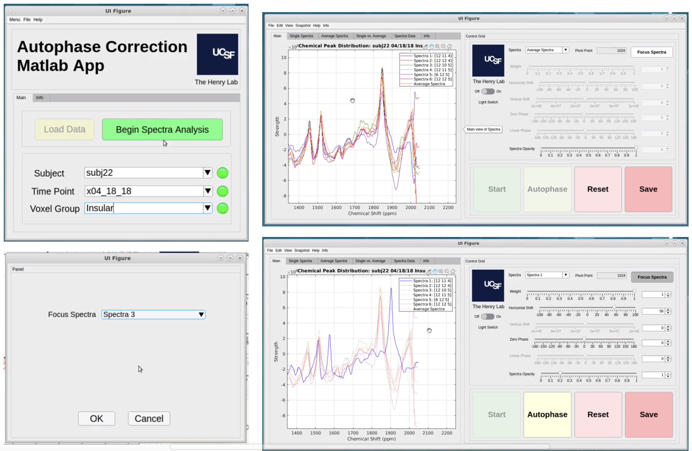

# SLASER & JDE Analysis For MRI

Author: Arya Bakhtiar

The contents of this repository represent a curated selection of our files, specifically tailored for public research purposes. Please note that this collection encompasses only a fraction of our comprehensive archive. All data files are protected under HIPAA and UCSF patient data policy. Please reach out for more inquiry regarding the project. 

## Software Interface

Below is an image of the software for measuring specific metabolites based on input subject files. 

